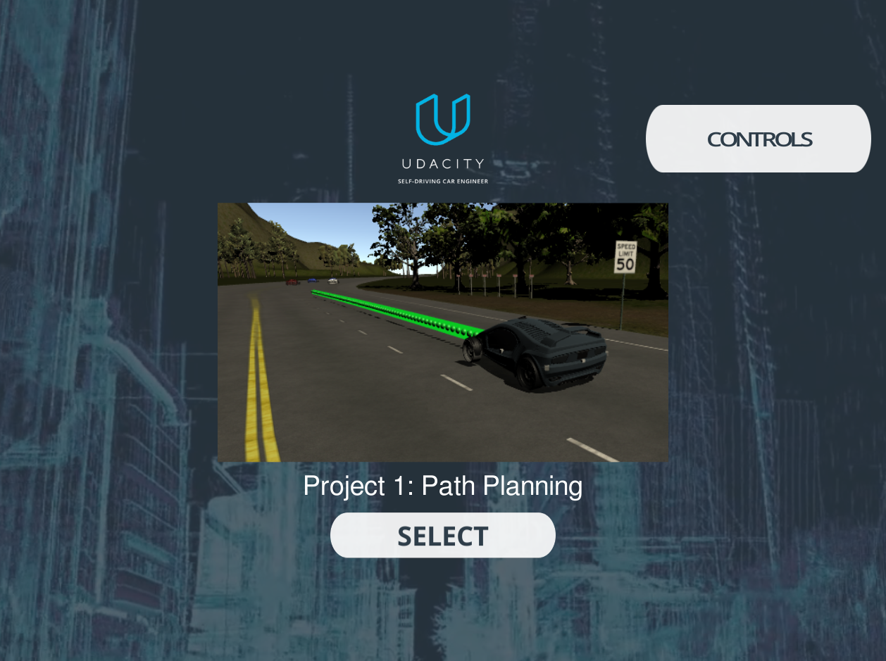
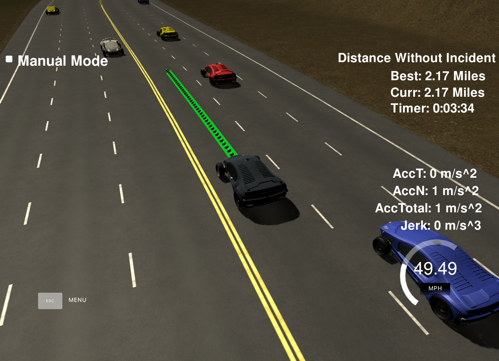
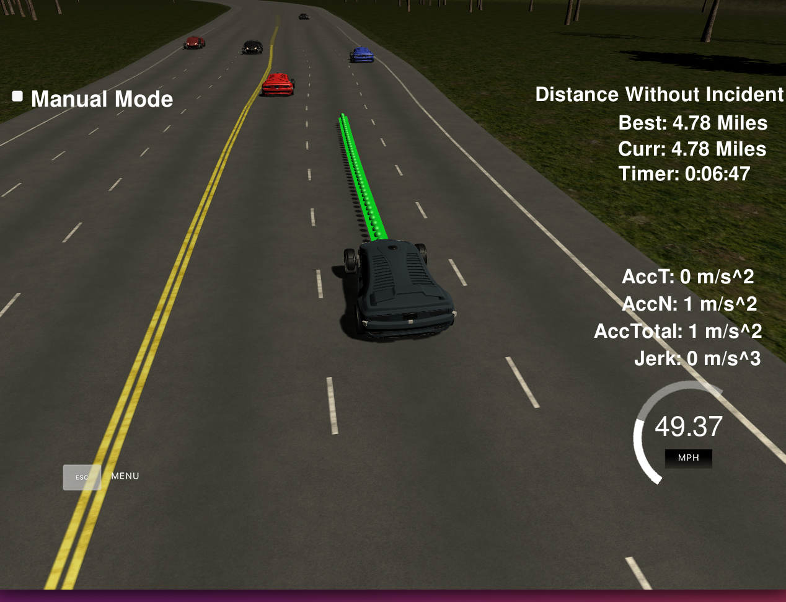
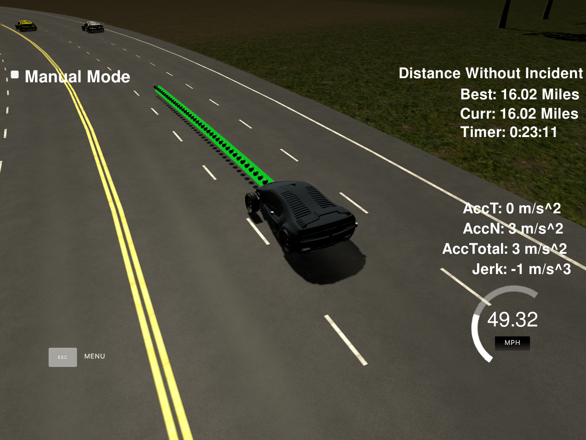
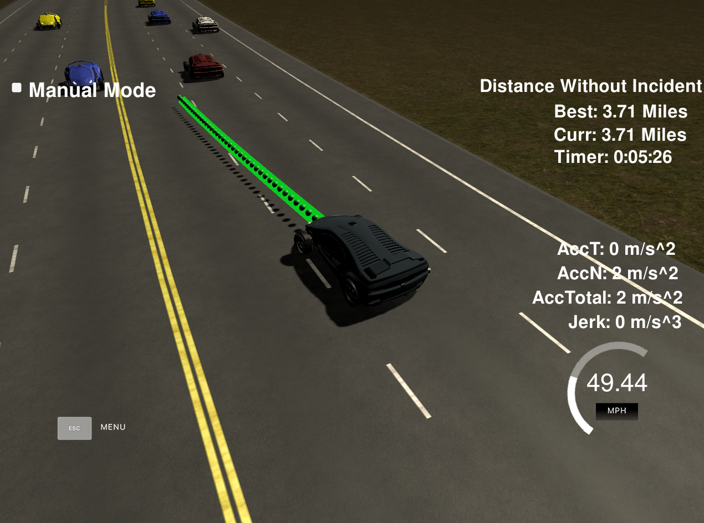

# CarND-Path-Planning-Project

### Simulator.
Simulator used for this project can be downloaded from here:
[releases tab (https://github.com/udacity/self-driving-car-sim/releases/tag/T3_v1.2).





### Goals
In this project your goal is to safely navigate around a virtual highway with other traffic that is driving +-10 MPH of the 50 MPH speed limit. You will be provided the car's localization and sensor fusion data, there is also a sparse map list of waypoints around the highway. The car should try to go as close as possible to the 50 MPH speed limit, which means passing slower traffic when possible, note that other cars will try to change lanes too. The car should avoid hitting other cars at all cost as well as driving inside of the marked road lanes at all times, unless going from one lane to another. The car should be able to make one complete loop around the 6946m highway. Since the car is trying to go 50 MPH, it should take a little over 5 minutes to complete 1 loop. Also the car should not experience total acceleration over 10 m/s^2 and jerk that is greater than 10 m/s^3.

## Basic Build Instructions

1. Clone this repo.
2. Make a build directory: `mkdir build && cd build`
3. Compile: `cmake .. && make`
4. Run it: `./path_planning`.

## Dependencies

* cmake >= 3.5
  * All OSes: [click here for installation instructions](https://cmake.org/install/)
* make >= 4.1
  * Linux: make is installed by default on most Linux distros
  * Mac: [install Xcode command line tools to get make](https://developer.apple.com/xcode/features/)
  * Windows: [Click here for installation instructions](http://gnuwin32.sourceforge.net/packages/make.htm)
* gcc/g++ >= 5.4
  * Linux: gcc / g++ is installed by default on most Linux distros
  * Mac: same deal as make - [install Xcode command line tools]((https://developer.apple.com/xcode/features/)
  * Windows: recommend using [MinGW](http://www.mingw.org/)
* [uWebSockets](https://github.com/uWebSockets/uWebSockets)
  * Run either `install-mac.sh` or `install-ubuntu.sh`.
  * If you install from source, checkout to commit `e94b6e1`, i.e.
    ```
    git clone https://github.com/uWebSockets/uWebSockets
    cd uWebSockets
    git checkout e94b6e1
    ```

## Results/Rubric validation

### Compile/Build project:
The package builds perfectly fine with Cmake. 
- tested on Ubuntu 16.04.

### Valid Trajectories:

Car was able to drive for miles without any collision




Car drives within the speed limit ranges - Checked 

Ego vehicle never exceeded maximum acceleration or jerk Limits - Checked

Car is always in the lane expect when performing a lane change maneuver - Checked

Car changes lanes accordingly - checked 


## Code Reflection:

The code provided is in ./src and the algorithm designed is centered in the main.cpp file with other dependencies from spline.h added to it.

### Prediction logic:
As the client is connected to the simulator first thing the logic starts of is by reading the sensor fusion data. The sensor fusion data has attributes of other cars on our heading side of the road:
 ["sensor_fusion"] A 2d vector of cars and then that car's [car's unique ID, car's x position in map coordinates, car's y position in map coordinates, car's x velocity in m/s, car's y velocity in m/s, car's s position in frenet coordinates, car's d position in frenet coordinates.

The logic start from LINE 250 to LINE 315 --> looks at the sensor fusion data for each target vehicles and checks if they are in our lane and within 30 meters distance from ego vehicle.

### Behavior logic:
The prediction logic returns flags for target vehicles in lane or not. These predictions are used from LINE 317 to LINE 344 to determine if we need to change lane and accelerate or decelerate safely with provided maximum acceleration limit to be 0.224 m/s2.

### Trajectory - Waypoints Generation:
For trajectory generation previous path end points along with far distance way points at 30, 60 and 90 meters are used to fit the spline function in local car coordinates. [Line 346-411]

Now we use the previous path waypoints plus the spline function and the reference velocity of the car (provided by behavior logic) to come up with new way points. This logic from LINE 413 to 437 calculated the new set of waypoints appending the previous paths non consumed points maintaining smooth consistency.
